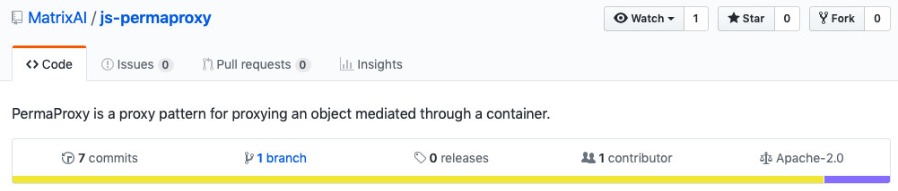

# funpermaproxy

**funpermaproxy** is a fork of [MatrixAI/js-permaproxy](https://github.com/MatrixAI/js-permaproxy) with some key differences and a continous integration suite.

The original repository was licensed under **Apache-2.0**, and this fork inherits [the license](LICENSE).

## Original description

PermaProxy is a proxy pattern for proxying an object mediated through a container.

Suppose you have some internal object exists in a container. You want to return a reference to this internal object. But you know that once you return such a reference, that reference may become invalid, because the container may change its internal reference. At the same time we cannot just return the container, since we must return something that behaves (type-wise) like the internal object. To solve this problem, we create a proxy that looks and acts just like the internal object. However it maintains a persistent link that is mediated through the container. If the container's reference changes, the proxy will point to the updated reference. In other words, we have created an abstract reference. Essentially what we have done is traded pointer referencing for property key name referencing. Note that there are serious performance considerations to doing this. Proxies are very slow compared to raw access to the internal object!

## Differences

1. Both `construct` and `apply` proxy traps were removed due to missing tests in the original code.
2. The exported function accepts a getter function as an argument, instead of an object reference and a property name.
3. Its implementation (setting proxy traps) is rewritten in arrow functions.
4. The repository has continuous integration set up.

## Credits

Licensed under [Apache-2.0 License](LICENSE).  
Original authorship: [Roger Qiu](https://github.com/CMCDragonkai) (2017).  
Fork authorship: [Yaroslav Serhieiev](https://github.com/noomorph) (2019).
